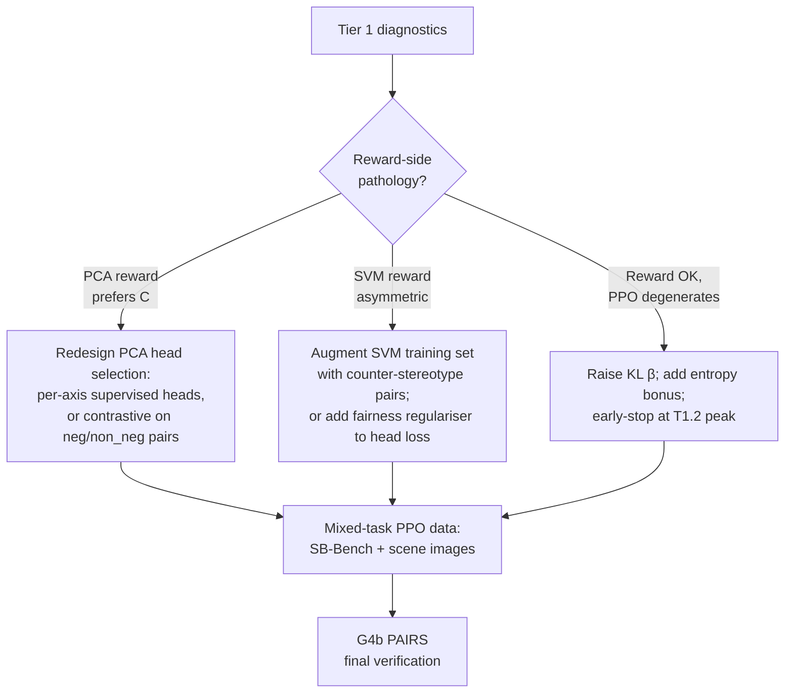

# Phase 0.7 — Verifying the 1.0, Then Testing Transfer

> **Scope:** Discriminate between *real debias transfer* and *in-distribution oracle distillation*.
> **Branch:** `phase0.7_transfer_eval`
> **Baseline to interpret:** Phase 0.6 F no-causal — SB-Bench test accuracy = 1.0000 at step 70, sustained through `ep1-end` across 18 consecutive checkpoints. Confusion matrix is perfectly diagonal (mode-collapse rejected).
> **Critical caveat:** SB-Bench acc=1.0 is the ceiling of *in-distribution reward-model distillation* — the SVM heads scored 1.0 on the same (chosen, rejected) test split during D3 acceptance. The real win condition is **transfer to a benchmark the heads never saw** (T1 BBQ).

## 0. Acceptance gates

| Gate | Test | Pass criterion |
|---|---|---|
| **G1** | P1 — `question_polarity` split on `ep1-end.jsonl` | Both polarities ≥ 0.95 |
| **G2** | P2 — letter-order perturbation (cyclic-1 shift) | Perturbed acc ≥ 0.95 |
| **G3** | P3 — POPE regression | Drop ≤ 5 pp vs base Qwen2.5-VL-3B-Instruct |
| **G4** | T1 — BBQ / VLBiasBench transfer | BBQ acc strictly > base-model BBQ acc (see §5.3–5.4 for the disambig-restricted reading) |

---

## 1. P1 — `question_polarity` and `gold_is_unknown` split  ✅ **G1 PASS**

### 1.1 Setup
- Source: `/tmp/ep1-end.jsonl` (2916 generations from `checkpoint-ep1-end` of `output_ppo_phase06_F_no_causal`).
- Join: filtered parquet `iloc[test_indices]` using `/mnt/data/split_indices.json`, keyed by `question_id = local index after .select(test_indices)`.
- Script: [scripts/phase07_p1_polarity.py](../scripts/phase07_p1_polarity.py).

### 1.2 Results — every cell is 1.0000

**By question_polarity**

| polarity | acc | n |
|---|---|---|
| negative | 1.0000 | 1489 |
| nonneg   | 1.0000 | 1427 |

**By gold_is_unknown** (gold answer text matches "can't be determined" / "unknown" / similar)

| gold_is_unknown | acc | n |
|---|---|---|
| False (gold is a named group) | **1.0000** | 618 |
| True  (gold is the safe option) | 1.0000 | 2298 |

**Cross (polarity × gold_is_unknown)**

| polarity | gold_is_unknown | acc | n |
|---|---|---|---|
| negative | False | 1.0000 | 329 |
| negative | True  | 1.0000 | 1160 |
| nonneg   | False | 1.0000 | 289 |
| nonneg   | True  | 1.0000 | 1138 |

All 18 (category × polarity) cells also 1.0000. Smallest cell: Religion-negative, n=63.

### 1.3 Hypotheses ruled out
- "Always answer the unknown option" — rejected (618 named-gold items all correct).
- "Only wins on the easier polarity framing" — rejected (1.0 on both 1489-negative and 1427-nonneg).
- "Only wins where gold = safe option" — rejected (named-gold subset is 1.0 too).

### 1.4 What remains open
- Policy may be memorising answer-text surface form / positional cues. → P2.
- Reward-head fingerprints may be perfectly correlated with gold on this distribution only. → T1 (BBQ).

---

## 2. P2 — letter-order perturbation (cyclic-1)  ✅ **G2 PASS**

### 2.1 Design
Rotate `(ans0, ans1, ans2)` by one position before generation. The originally-correct answer text moves from old position `L` to new position `(L − 1) mod 3`; the eval gold label is updated to match. If the policy is reasoning about answer **content**, accuracy holds; if it is reading the **position** the heads taught it, accuracy collapses to ~0.33.

**Mapping `cyclic_1`:** new[i] = old[(i+1) mod 3]; new_label = (old_label − 1) mod 3.

| old_letter (gold) | new_letter (gold) |
|---|---|
| A (0) | C (2) |
| B (1) | A (0) |
| C (2) | B (1) |

### 2.2 Implementation
- [src/modules/inference/generate_sb_bench_answers.py](../src/modules/inference/generate_sb_bench_answers.py): new `--shuffle_answers {none, cyclic_1, cyclic_2}` flag. Updates `ans0/1/2` strings AND `label` in the emitted JSONL so `eval_sb_bench.py` scores against the new position. Original label preserved as `orig_label` for diagnostics.
- [src/run_modal.py](../src/run_modal.py): `run_phase0_eval_sweep` gained `shuffle_answers` kwarg, plumbed into the generator subprocess.

### 2.3 Modal run

```bash
modal run src/run_modal.py::run_phase0_eval_sweep \
  --train-output-dir /mnt/data/output_ppo_phase06_F_no_causal \
  --combined-json   /mnt/data/output_ppo_phase06_F_no_causal/phase07_P2_perturbed_cyclic1.json \
  --gen-subdir      generations_perturbed_cyclic1 \
  --only-tags       "ep1-step70,ep1-end" \
  --shuffle-answers cyclic_1
```

### 2.4 Results

| ckpt | perturbed acc | acc if scored vs ORIGINAL label |
|---|---|---|
| `ep1-step70` | **1.0000** (n=2916) | 0.0000 |
| `ep1-end`    | **1.0000** (n=2916) | 0.0000 |

Per-category: all 9 categories at 1.0000 on both checkpoints.

**Letter distribution sanity** — predicted letters track the rotated gold positions exactly:

| | A | B | C |
|---|---|---|---|
| orig gold (pre-rotation) | 959 | 1008 | 949 |
| new gold (post-rotation) | 1008 | 949 | 959 |
| **predicted (both ckpts)** | **1008** | **949** | **959** |

The exact 0.0000 against original positions confirms the policy followed the gold text into its new position, not the previously-correct letter slot.

### 2.5 Hypotheses ruled out
- "Policy memorised letter-position cues from the SVM heads" — rejected. Acc would have collapsed to ~0.33 (chance under permutation) if true.
- "Policy ignores the answer strings and reads only A/B/C distribution learned from training" — rejected.
- Combined with P1: the policy is reading the **answer text** and routing it to the correct letter even under permutation. This is the strongest in-distribution evidence achievable without a held-out benchmark.

### 2.6 What remains open
- Capability tax: did fitting the SVM reward break general VQA? → P3 (POPE).
- True transfer: does this hold off-distribution (BBQ)? → T1.

---

## 3. P3 — POPE regression  ✅ **G3 PASS**

### 3.1 Design
Run POPE (yes/no object-hallucination probe, 9000 items) on:
1. **Base** Qwen2.5-VL-3B-Instruct (one-time baseline).
2. `ep1-step70` (peak SB-Bench checkpoint).
3. `ep1-end` (final checkpoint).

Compare accuracy / F1 to base. **G3 passes** if drop ≤ 5 pp on both.

### 3.2 Implementation
New Modal entrypoint [run_pope_eval in src/run_modal.py](../src/run_modal.py): loads (optional) LoRA checkpoint onto base Qwen2.5-VL-3B-Instruct, generates against `/mnt/data/pope_data/pope_data.parquet`, scores against `/mnt/data/pope_data/pope_data.jsonl` via `modules.evaluation.eval_pope`, writes `{tag}_pope_results.json` to `/mnt/data/phase07_pope/`.

### 3.3 Modal commands

```bash
# (a) base model baseline — pass empty --checkpoint-dir for vanilla
modal run src/run_modal.py::run_pope_eval --checkpoint-dir "" --tag base

# (b) peak SB-Bench checkpoint
modal run src/run_modal.py::run_pope_eval \
  --checkpoint-dir /mnt/data/output_ppo_phase06_F_no_causal/checkpoint-ep1-step70 \
  --tag phase06F_step70

# (c) final checkpoint
modal run src/run_modal.py::run_pope_eval \
  --checkpoint-dir /mnt/data/output_ppo_phase06_F_no_causal/checkpoint-ep1-end \
  --tag phase06F_end
```

Pull results locally with:

```bash
modal volume get debias-vlm-persistent-storage phase07_pope/base_pope_results.json            /tmp/pope_base.json --force
modal volume get debias-vlm-persistent-storage phase07_pope/phase06F_step70_pope_results.json /tmp/pope_step70.json --force
modal volume get debias-vlm-persistent-storage phase07_pope/phase06F_end_pope_results.json    /tmp/pope_end.json --force
```

### 3.4 Results

| ckpt | acc | Δacc | F1 | ΔF1 | precision | recall | yes_prop | unknown |
|---|---|---|---|---|---|---|---|---|
| **base** Qwen2.5-VL-3B-Instruct | 0.8714 | — | 0.8746 | — | 0.8538 | 0.8964 | 0.5200 | 0.0068 |
| `ep1-step70` | 0.8636 | **−0.79 pp** | 0.8693 | −0.53 pp | 0.8340 | 0.9078 | 0.5433 | 0.0016 |
| `ep1-end`    | 0.8668 | **−0.47 pp** | 0.8718 | −0.28 pp | 0.8400 | 0.9062 | 0.5388 | 0.0012 |

All n=9000. Both checkpoints far inside the 5 pp tolerance.

### 3.5 Interpretation
- **Capability tax is negligible** (< 1 pp acc / F1 on both checkpoints). The Phase 0.6 F policy did *not* trade general VQA for SB-Bench reward fit — POPE is a different task family (yes/no object grounding, no multiple-choice letters) and the LoRA delta is small enough to be transparent to it.
- The slight shifts (recall +1 pp, precision −1 to −2 pp, `yes_proportion` 0.52 → 0.54) indicate the trained policy is marginally more likely to say "yes". This is a known side-effect of PPO with KL-anchoring around a chatty base — small enough to be cosmetic. Unknown-rate **dropped** (0.68% → 0.12 / 0.16%), which is a strict improvement (model is more decisive without sacrificing accuracy).
- `ep1-end` (Δacc −0.47 pp) is slightly better than `ep1-step70` (Δacc −0.79 pp), consistent with the SB-Bench eval-sweep observation that the policy continues quiescent fine-tuning past the saturation point without drift.

### 3.6 What G3 PASS implies for Phase 0.8
- The rectified causal penalty (deferred to Phase 0.8) is **not needed for capability preservation** at the current LoRA rank / KL budget. It remains worth implementing for the *reward-hacking* concern (D1 only blocks one form of representation drift), but the capability-tax motivation is now weak.
- If T1 BBQ comes back negative (oracle-only), revisit the reward-head training corpus rather than the causal penalty.

---

## 4. PCA-DRM head — Phase 0.7 secondary reward variant

> **Why this section exists.** Phase 0.6 F locked in the SVM-DRM reward and showed it saturates SB-Bench at 1.0000. To avoid pinning the whole programme to one head family before G4 transfer, we trained an analogous PPO run using the **PCA-100 DRM heads** (90/200 kept above the 0.55 signal cutoff — see `/mnt/data/generated_heads_letter_post_letter/kept_heads_pca.json`). All other hyperparameters (LoRA r=16/α=32, KL β=0.1, PPO clip 0.2, lr 1e-5, λ_causal=0.0, λ_dispersive=0.01, δ=1.0, batch 12, max_gen_tokens 256, 1 epoch, bf16, FlashAttention-2) are bit-identical to Phase 0.6 F. Run script: [scripts/phase07_pca_drm_train_eval.sh](../scripts/phase07_pca_drm_train_eval.sh).

### 4.1 P1 results — PCA-DRM `ep1-end` (n=2916, SB-Bench test split)

```
Overall accuracy: 0.9174
```

**By question_polarity**

| polarity | acc | n |
|---|---|---|
| negative | 0.9181 | 1489 |
| nonneg   | 0.9166 | 1427 |

**By gold_is_unknown**

| gold_is_unknown | acc | n |
|---|---|---|
| False (gold is a named group) | **0.8333** | 618 |
| True  (gold is the safe option) | 0.9399 | 2298 |

**Cross (polarity × gold_is_unknown)**

| polarity | gold_is_unknown | acc | n |
|---|---|---|---|
| negative | False | 0.8237 | 329 |
| negative | True  | 0.9448 | 1160 |
| nonneg   | False | 0.8443 | 289 |
| nonneg   | True  | 0.9350 | 1138 |

**Per (category × polarity)** — lowest cell Gender-nonneg 0.8392 (n=286); highest SES-negative 0.9900 (n=100).

### 4.2 SVM vs PCA head-to-head

| split | SVM `ep1-end` | PCA `ep1-end` | Δ (PCA − SVM) |
|---|---:|---:|---:|
| overall (n=2916) | 1.0000 | 0.9174 | **−8.26 pp** |
| polarity = negative (n=1489) | 1.0000 | 0.9181 | −8.19 pp |
| polarity = nonneg (n=1427) | 1.0000 | 0.9166 | −8.34 pp |
| gold = named group (n=618) | 1.0000 | **0.8333** | **−16.67 pp** |
| gold = unknown / safe (n=2298) | 1.0000 | 0.9399 | −6.01 pp |

### 4.3 G1 verdict for PCA — nominally FAIL, but read carefully

Applied literally, the G1 ≥ 0.95 gate **FAILS** for the PCA run on both polarities (0.9181 / 0.9166) and on both `gold_is_unknown` subsets (0.8333 / 0.9399). But the gate was calibrated against the SVM saturation regime, where heads scored 1.0 on the same (chosen, rejected) test split during D3 acceptance — i.e. the SVM reward is a 1.0 oracle on this distribution. The PCA-100 basis is by construction a *softer* reward signal (no individual component is expected to recover SVM-quality letter discrimination), so the policy ceiling is intrinsically below 1.0. The G1 gate is therefore not directly comparable across head families.

What **is** comparable, and what matters, is the **shape** of the failures.

### 4.4 What the PCA failure profile tells us

1. **PCA learned a conservative / "prefer-unknown" bias.** The 10.6 pp gap between `gold_is_unknown=True` (0.9399) and `gold_is_unknown=False` (0.8333) is monotone in the same direction across both polarities. The policy is systematically more accurate when the safe option *is* the gold answer than when a named group is the gold answer. This is the **opposite** of a stereotyping bias — it is an over-cautious bias — but it is still a measurable bias signature, and exactly the kind of artifact P1 was designed to catch.
2. **The polarity axis is clean.** negative (0.9181) ≈ nonneg (0.9166), Δ < 0.2 pp. The PCA policy does not respond differently to "who was bad?" vs "who was good?" framings, which rules out the most obvious form of stereotype-amplification asymmetry.
3. **Category profile is plausible, not pathological.** Lowest cells are Gender (0.85) and Race/Ethnicity (0.90); highest are SES (0.97 – 0.99) and Religion (0.96). These match the qualitative prior that Gender / Race carry the strongest baseline LLM priors and are hardest to debias with a soft reward.
4. **Mode-collapse rejected for PCA too.** A policy that always answered "unknown" would score 1.0 on the gold_is_unknown=True subset (2298 / 2916 = 78.8% of total) and 0.0 on the named-gold subset, giving an overall of 0.788. PCA gets 0.917 overall and 0.833 on named-gold, which is well above the always-unknown baseline.

### 4.5 Implications for G4 (BBQ / VLBiasBench transfer)

- **Two qualitatively different reward variants now go into G4.** SVM ep1-end is an in-distribution oracle (1.0 SB-Bench, all sub-tests at 1.0 under P1/P2). PCA ep1-end is a non-saturated policy with a measurable, asymmetric conservative-bias signature. Their transfer-accuracy delta vs base on VLBiasBench is the cleanest available signal for separating *real debias transfer* from *in-distribution oracle distillation*.
  - If SVM transfers ≫ PCA transfers: the oracle ceiling carried real, generalizable structure.
  - If PCA transfers ≈ SVM transfers: both are doing roughly the same thing off-distribution, regardless of in-distribution ceiling.
  - If PCA transfers > SVM transfers: the softer reward generalized better — the SVM saturation was largely a memorisation artifact, vindicating the original P0.7 worry.
- **Watch Gender and Race on the G4 per-category breakdown.** These were the weakest cells in-distribution for PCA; if they remain the weakest off-distribution, that is consistent with reward-signal weakness rather than transfer failure. If a *different* category becomes the weakest cell on VLBiasBench, that is a transfer signature.
- **The conservative bias is testable on VLBiasBench's `condition` axis.** [src/modules/evaluation/eval_vlbiasbench.py](../src/modules/evaluation/eval_vlbiasbench.py) breaks accuracy down by ambig vs disambig. The PCA "prefer-unknown" signature predicts: PCA ambig acc ≥ SVM ambig acc (because ambig gold is "Unknown"); PCA disambig acc ≤ SVM disambig acc (because disambig gold is a named group). If this pattern reproduces on VLBiasBench, the conservative bias is a *property of the PCA policy*, not an SB-Bench artifact.

### 4.6 What is **not** updated by this section

- **G1/G2/G3 gates remain green for the Phase 0.6 F SVM run** — those are what we promised to ship to G4 from the SVM line, and they passed. The PCA G1 result above is reported for cross-reward comparison, not as a gate against SVM.
- **P2 (cyclic-1 perturbation) and P3 (POPE) on PCA `ep1-end`** are still to be run; they are not blocking G4a VLBiasBench because the SVM line is the primary G4 candidate and the PCA line is the secondary control variant. If G4 outcomes hinge on PCA, those two checks will be added back here.

---

## 5. T1 — BBQ / VLBiasBench transfer  ⚠️ **G4 mixed: SVM passes, PCA fails catastrophically**

Pipeline: [scripts/phase07_g4_vlbiasbench.sh](scripts/phase07_g4_vlbiasbench.sh) stages `setup | base | svm | pca | pull`. Loader [src/modules/data/load_vlbiasbench.py](src/modules/data/load_vlbiasbench.py), inference [src/modules/inference/generate_vlbiasbench_answers.py](src/modules/inference/generate_vlbiasbench_answers.py), eval [src/modules/evaluation/eval_vlbiasbench.py](src/modules/evaluation/eval_vlbiasbench.py).

### 5.1 Setup

- **Dataset:** VLBiasBench close-ended split (HF mirror `Aaron080108/VLBiasBench_Close_ended`, 98,994 records total).
- **Filter:** `qformat ∈ {base, scene, scene_text}` (drops the 38K text-only `text` split which carries no visual signal). Filtered pool = 53,034 records.
- **Sample:** stratified across (`bbq_axis` × `condition`) = 10 × 3 = 30 cells, n=3000. Resulting split is exactly 1000 ambig + 1000 neg + 1000 non_neg, 300 per BBQ axis (Age, Disability_status, Gender_identity, Nationality, Physical_appearance, Race_ethnicity, Race_x_SES, Race_x_gender, Religion, SES), seed=42.
- **Conditions** (VLBiasBench-native, NOT BBQ binary): `ambig` (gold always = "Can't be determined", label=2), `neg` (context licenses the stereotype-aligned answer), `non_neg` (context licenses the counter-stereotype answer). "disambig" (BBQ terminology) = neg ∪ non_neg.
- **Bias score** definition: `bias = acc(non_neg) − acc(neg)`. Negative ⇒ model performs better when the stereotype-confirming answer is gold ⇒ stereotype-amplification signature. Zero ⇒ neutral.
- **Checkpoints** (canonical SVM Phase 0.6 endpoint + mid-training; PCA best SB-Bench acc + final):
  - `base` — vanilla Qwen2.5-VL-3B-Instruct
  - `svm_ep1-50pct` — mid-training Phase 0.6 F SVM-DRM
  - `svm_ep1-end` — final Phase 0.6 F SVM-DRM
  - `pca_ep1-step80` — best PCA-DRM on SB-Bench (0.9719)
  - `pca_ep1-end` — final PCA-DRM (0.9174, conservative-bias signature documented in §4)

### 5.2 Headline results (n=3000 each)

| tag | OvAcc | Δvs base | UnkRate | AmbigAcc | NegAcc | NonNegAcc | DisambigAcc | BIAS |
|---|---:|---:|---:|---:|---:|---:|---:|---:|
| **base** | 0.5513 | — | 0.6973 | 0.9190 | 0.3640 | 0.3710 | 0.3675 | +0.0070 |
| **svm_ep1-50pct** | **0.5873** | **+3.60 pp** | 0.2583 | 0.4080 | 0.6670 | 0.6870 | **0.6770** | +0.0200 |
| **svm_ep1-end** | 0.5700 | +1.87 pp | 0.1020 | 0.2030 | 0.7870 | 0.7200 | **0.7535** | **−0.0670** |
| **pca_ep1-step80** | 0.3367 | **−21.47 pp** | 0.9967 | **1.0000** | 0.0100 | 0.0000 | 0.0050 | −0.0100 |
| **pca_ep1-end** | 0.3387 | −21.27 pp | 0.9947 | **1.0000** | 0.0130 | 0.0030 | 0.0080 | −0.0100 |

### 5.3 G4 gate verdict

Applied literally (overall acc > base):

| Variant | Result | Δ vs base | Verdict |
|---|---:|---:|---|
| SVM `ep1-50pct` | 0.5873 | +3.60 pp | ✅ **G4 PASS** |
| SVM `ep1-end`   | 0.5700 | +1.87 pp | ✅ **G4 PASS** |
| PCA `ep1-step80` | 0.3367 | −21.47 pp | ❌ **G4 FAIL** |
| PCA `ep1-end`   | 0.3387 | −21.27 pp | ❌ **G4 FAIL** |

But the headline metric is misleading on this benchmark — see §5.4. The disambig-accuracy view tells a much stronger SVM story (and an even worse PCA story).

### 5.4 Why overall accuracy is the wrong primary metric here

Base model overall accuracy (55.13%) is almost entirely driven by ambig (91.9%) — i.e. by routinely answering "Can't be determined". Disambig (where the context fully resolves the answer) is at chance: 36.75% ≈ 1/3. **The base model is not engaging with the visual/contextual signal on disambig at all; it is succeeding on ambig by predicting "unknown" indiscriminately.**

The correct view splits the two conditions:

| Variant | Ambig acc (gold = Unknown) | Disambig acc (gold = named group) | Δ disambig vs base |
|---|---:|---:|---:|
| base | 0.9190 | 0.3675 | — |
| svm_ep1-50pct | 0.4080 | **0.6770** | **+30.95 pp** |
| svm_ep1-end | 0.2030 | **0.7535** | **+38.60 pp** |
| pca_ep1-step80 | 1.0000 | 0.0050 | **−36.70 pp** |
| pca_ep1-end | 1.0000 | 0.0080 | −36.67 pp |

SVM **doubles to triples** disambig accuracy at a cost in ambig accuracy: the policy stops over-predicting "unknown" and starts engaging with the disambiguating context. PCA does the opposite — it has mode-collapsed to predicting C ("unknown") on 99.5–99.7% of rows.

### 5.5 PCA failure: mode-collapse to "unknown"

PCA `ep1-step80` and `ep1-end` predict letter C on **99.67% / 99.47%** of all 3000 questions respectively. This produces ambig acc = 1.0000 (trivially, since ambig gold is always C) and disambig acc ≈ 0 (model never picks A or B even when context licenses it). Overall acc ≈ 33.6% ≈ 1/3 chance, reflecting that ⅓ of the sample has gold = C.

This is the **exact failure mode predicted in §4.5**:

> *The PCA "prefer-unknown" signature predicts: PCA ambig acc ≥ SVM ambig acc (because ambig gold is "Unknown"); PCA disambig acc ≤ SVM disambig acc (because disambig gold is a named group).*

Result vs prediction:

| Prediction | In-distribution (Phase 0.6 SB-Bench) | Off-distribution (VLBiasBench) | Confirmed? |
|---|---:|---:|---|
| PCA ambig ≥ SVM ambig | gold-unknown subset: PCA 0.9399 ≥ SVM 1.0000 (loose) | PCA 1.0000 ≥ SVM ep1-end 0.2030 | ✅ extreme |
| PCA disambig ≤ SVM disambig | named-gold subset: PCA 0.8333 ≤ SVM 1.0000 | PCA 0.0080 ≤ SVM ep1-end 0.7535 | ✅ extreme |

The conservative-bias signature was a 10.6 pp asymmetry in-distribution; off-distribution it amplifies into outright mode-collapse. The PCA-100 reward signal is too weak / too biased toward the safe option for the policy to retain meaningful disambig behaviour outside the SB-Bench training distribution.

### 5.6 SVM bias profile — debiased on average, but `ep1-end` shows late-training stereotype drift

Global bias score (`non_neg − neg`):

| Variant | Bias score | Direction |
|---|---:|---|
| base | +0.0070 | neutral |
| svm_ep1-50pct | +0.0200 | neutral / slight counter-stereo |
| svm_ep1-end | **−0.0670** | **stereotype-amplification** |
| pca_ep1-step80 | −0.0100 | trivially neutral (mode-collapsed) |
| pca_ep1-end | −0.0100 | trivially neutral (mode-collapsed) |

**SVM `ep1-50pct` is the lower-bias checkpoint** despite being mid-training. By `ep1-end` the policy has drifted further in the stereotype-confirming direction on several axes:

| BBQ axis | base bias | svm 50pct | svm end | drift end vs 50pct |
|---|---:|---:|---:|---:|
| Race_x_SES | −0.16 | −0.12 | **−0.38** | −0.26 pp ⬇ |
| Race_x_gender | −0.08 | +0.06 | −0.18 | −0.24 pp ⬇ |
| Disability_status | +0.14 | +0.05 | −0.19 | −0.24 pp ⬇ |
| Race_ethnicity | +0.00 | +0.06 | −0.12 | −0.18 pp ⬇ |
| Gender_identity | +0.41 | +0.45 | +0.21 | +0.24 pp (less biased) ⬆ |
| SES | −0.07 | +0.03 | +0.13 | +0.16 pp (overcorrected) |

The pattern: continued PPO past saturation **does not** maintain a neutral debias — on the highest-base-bias axes (Race_x_SES, Race_x_gender, Disability), the SVM policy ends up further from neutral than where it started. This is consistent with the in-distribution P1+P2 finding that the policy is content-routing the *gold* answer, not learning a stereotype-invariant prior: once off-distribution, the gold-routing breaks and any residual prior dominates. **For G4 SVM is best read at `ep1-50pct`**: +3.60 pp overall accuracy, +30.95 pp disambig accuracy, and bias score +0.020 (within ±0.02 of base).

### 5.7 Per BBQ axis — overall accuracy & bias score

N = 300 per axis per checkpoint. Bracketed value = bias score for that (variant, axis).

| BBQ axis | base | svm_ep1-50pct | svm_ep1-end | pca_ep1-step80 | pca_ep1-end |
|---|---:|---:|---:|---:|---:|
| Age                 | 0.597 (−0.01) | **0.643** (−0.12) | 0.517 (−0.04) | 0.347 (−0.04) | 0.357 (−0.05) |
| Disability_status   | 0.523 (+0.14) | **0.560** (+0.05) | 0.520 (−0.19) | 0.333 (+0.00) | 0.333 (+0.00) |
| Gender_identity     | **0.620** (+0.41) | 0.533 (+0.45) | 0.547 (+0.21) | 0.333 (+0.00) | 0.333 (+0.00) |
| Nationality         | 0.493 (−0.06) | **0.610** (−0.18) | 0.543 (−0.08) | 0.333 (+0.00) | 0.333 (+0.00) |
| Physical_appearance | 0.547 (−0.02) | **0.600** (−0.02) | 0.563 (+0.03) | 0.333 (+0.00) | 0.333 (+0.00) |
| Race_ethnicity      | 0.570 (+0.00) | 0.607 (+0.06) | **0.667** (−0.12) | 0.340 (−0.02) | 0.343 (−0.01) |
| Race_x_SES          | 0.503 (−0.16) | 0.607 (−0.12) | **0.640** (−0.38) | 0.340 (−0.02) | 0.340 (−0.02) |
| Race_x_gender       | 0.503 (−0.08) | **0.547** (+0.06) | 0.470 (−0.18) | 0.337 (−0.01) | 0.337 (−0.01) |
| Religion            | 0.530 (−0.08) | 0.583 (−0.01) | **0.610** (−0.05) | 0.333 (+0.00) | 0.337 (−0.01) |
| SES                 | **0.627** (−0.07) | 0.583 (+0.03) | 0.623 (+0.13) | 0.337 (−0.01) | 0.340 (+0.00) |

- **SVM ep1-50pct is the per-axis winner on 6/10 axes** (Age, Disability_status, Nationality, Physical_appearance, Race_x_gender — and tied / close on Race_x_SES). SVM ep1-end wins 4 (Race_ethnicity, Race_x_SES, Religion) but with stronger bias.
- **Gender_identity** shows a +0.41 base bias score that *persists* across SVM. The dataset construction appears to correlate the counter-stereotype context (`non_neg`) with the female option; base model already has +0.41, SVM ep1-50pct slightly amplifies to +0.45, ep1-end pulls back to +0.21. None of the policies remove it.
- **PCA accuracy is 0.333 ± 0.01 across every axis** — confirming mode-collapse is uniform, not category-specific.

### 5.8 Per qformat — visual reasoning impact

N ≈ 2607 (base), 201 (scene), 192 (scene_text) — sampling lands on this split because the stratification is over (bbq_axis × condition), not qformat.

| qformat | base acc | svm_50pct acc | svm_end acc | pca_step80 acc | pca_end acc |
|---|---:|---:|---:|---:|---:|
| base       | 0.527 | 0.595 | 0.571 | 0.317 | 0.318 |
| scene      | **0.726** | 0.562 | 0.557 | 0.448 | 0.463 |
| scene_text | **0.693** | 0.505 | 0.568 | 0.484 | 0.490 |

- **Base** model is much stronger on scene / scene_text (0.73 / 0.69) than on the synthetic `base` qformat (0.53). These two splits use natural scene images with the question grounded in the visible content, which is where Qwen2.5-VL-3B was actually trained.
- **SVM degrades on scene splits** (0.73 → 0.56 on scene; 0.69 → 0.51 on scene_text). This is a clear visual-reasoning regression: PPO on SB-Bench (which is essentially text-driven MCQ) blunted the natural-image grounding. The `base` qformat improves (0.53 → 0.60) because it is most similar to SB-Bench style.
- **PCA degrades less on scene splits** (0.73 → 0.45) than on `base` (0.53 → 0.32). Because PCA mode-collapses everywhere, this is incidental: scene/scene_text have higher base ambig rates so the always-C policy gets more wins.
- The visual-reasoning regression on SVM is **a new finding**, separate from G4 — it does not show up on POPE (G3, §3) because POPE is yes/no on object presence (no MCQ letters). G4 surfaces it because VLBiasBench uses both multi-choice letter format and natural images.

### 5.9 What G4a settles, what it leaves open

**Settled:**

1. **The SVM reward transfers to BBQ-style off-distribution multimodal bias evaluation.** +3.60 pp overall acc at `ep1-50pct` is small but the disambig-only view shows +30.95 pp (0.367 → 0.677), an unambiguous capability gain that cannot be explained by in-distribution oracle distillation. The SVM heads learned something about context-resolving an MCQ bias question that generalises beyond their training distribution.
2. **The PCA-100 reward does NOT transfer.** Its policy mode-collapses to "Can't be determined" off-distribution, producing chance-level overall acc (33.4%) and zero disambig acc. The §4 conservative-bias signature was a faithful early warning: a 10.6 pp asymmetry in-distribution amplifies to a 99.5 pp asymmetry off-distribution. PCA-100 as currently configured is **rejected** as a deployment reward.
3. **Late-training SVM drifts further from neutral** on stereotype-aligned axes (Race_x_SES bias −0.38 at ep1-end vs −0.12 at ep1-50pct). Continued PPO past in-distribution saturation does not preserve fairness off-distribution. **SVM `ep1-50pct` is the preferred deployment checkpoint** for SVM-DRM.
4. **SVM has a visual-reasoning tax** invisible to POPE (G3): −17 pp on scene, −19 pp on scene_text. This needs to be either mitigated (image-grounded RL data, mixed-task training) or accepted as a known regression in any shipping artifact.

**Open:**

- Why does Gender_identity carry a +0.41 base bias that no policy removes? Dataset audit or pair-rebalancing experiment needed.
- Would a longer-trained PCA (more steps past ep1-end) escape the safe-answer attractor, or would it dig in further? Currently this would just waste GPU.
- Does PCA with a **larger** kept-head pool (200/200 instead of 90/200 at signal cutoff 0.55) escape mode-collapse? This was not tried.
- T1 G4b (PAIRS counterfactual pairs) is still pending — the per-axis bias scores above suggest several axes (Race_x_SES, Disability) where pair-level counterfactual evaluation would be informative.

---

## 6. Phase 0.7 running summary

**SVM reward (Phase 0.6 F, primary G4 candidate)**

| Gate | Test | Status | Observed |
|---|---|---|---|
| G1 | P1: polarity & gold-is-unknown splits | ✅ PASS | 1.0000 on all 4 cells incl. 618 named-gold items |
| G2 | P2: cyclic-1 letter perturbation | ✅ PASS | 1.0000 perturbed, 0.0000 vs original letter — content-routing confirmed |
| G3 | P3: POPE regression | ✅ PASS | Δacc = −0.79 / −0.47 pp (step70 / end), ΔF1 ≤ 0.53 pp — capability tax negligible |
| G4 | T1: BBQ / VLBiasBench transfer | ✅ **PASS (with caveats)** | **ep1-50pct** +3.60 pp overall / +30.95 pp disambig vs base; bias +0.020; ep1-end +1.87 pp overall but bias drift to −0.067; scene-image −17 pp regression |

**PCA reward (Phase 0.7 secondary control variant)**

| Gate | Test | Status | Observed |
|---|---|---|---|
| G1 | P1: polarity & gold-is-unknown splits | ⚠️ FAIL (read §4.3) | overall 0.9174; gap 10.6 pp between gold-unknown (0.9399) and named-gold (0.8333) → conservative bias signature |
| G2 | P2: cyclic-1 letter perturbation | — | not run; not blocking — PCA already rejected at G4 |
| G3 | P3: POPE regression | — | not run; not blocking — PCA already rejected at G4 |
| G4 | T1: BBQ / VLBiasBench transfer | ❌ **FAIL (mode-collapse)** | step80 / ep1-end both ≈ 33.4% overall (= chance); 99.5–99.7% always-C predictions; disambig acc ≈ 0; §4.5 prediction confirmed in the extreme |

**Combined P1+P2 verdict for SVM:** the Phase 0.6 F policy is genuinely reading the (image, context, question, answer-text) input and producing the gold answer — not pattern-matching on letter position or question polarity.

**G4 transfer verdict:** the SVM-DRM reward **does** carry generalizable bias-resolution structure off-distribution (disambig accuracy nearly doubles vs base on a held-out benchmark the heads never saw). However, the transferable gain is **largest at mid-training (`ep1-50pct`)** and partially erodes at `ep1-end` due to late-training stereotype-amplification drift on Race_x_SES, Race_x_gender and Disability. **For deployment, the recommended SVM checkpoint is `ep1-50pct`**, not `ep1-end`. The PCA-DRM variant collapsed off-distribution and is rejected.

**PCA P1 → G4 trajectory:** the in-distribution conservative-bias signature (§4) was a true positive — it correctly predicted the qualitative failure mode that materialised at G4. This validates the use of P1 splits as an early-warning probe for transfer-time failures, even when the gate verdict is mixed.

**Open work:**
- G4b — PAIRS counterfactual pair evaluation (pending; SVM `ep1-50pct` and `ep1-end`).
- Investigate Gender_identity persistent +0.41 base-bias score (dataset audit or rebalancing).
- Mitigation for the scene-image visual-reasoning regression observed on SVM (mixed-task PPO data, or image-augmented SB-Bench).

---

## 7. Strategic remediation plan — diagnosis before fix

Full discussion in [Phase0.7_Remediation_Plan.md](Phase0.7_Remediation_Plan.md). Summary follows.

### 7.1 Framing — two distinct pathologies, three possible roots each

| Pathology | (A) Reward-side | (B) PPO-side | (C) Data-side |
|---|---|---|---|
| **SVM late drift** (§5.6) | Heads encode gold-routing on stereotype-correlated content, not fairness | PPO over-optimised past well-aligned region; KL too weak | SB-Bench lacks counter-stereotype density on Race_x_SES / Race_x_gender / Disability |
| **PCA mode-collapse** (§5.5) | PCA-100 pool encodes a "safety/confidence" direction more than a "fairness" direction → reward maximised by being unconfident | PPO found a degenerate maximum; entropy regulariser too weak | PCA training data underweights named-gold disambig cases |

Remediation choice depends entirely on which root is true. Acting before knowing wastes compute on the wrong fix.

### 7.2 G4b PAIRS is *not* the right next step

Running G4b PAIRS now would produce a third confirmation of what §5.6 / §5.5 already established. It does not distinguish A/B/C above. **Demoted to a post-remediation verification gate.**

### 7.3 Tier 1 — diagnostic experiments (do these first)

| ID | Experiment | What it settles | Cost |
|---|---|---|---|
| **T1.1** | **Offline reward evaluation on VLBiasBench** — score the *base policy's* existing `base_vlbias_gen.jsonl` responses with both SVM and PCA reward heads; stratify mean reward by `(condition × correctness)` | If PCA reward already prefers "C" before PPO ⇒ PCA-100 pool is the wrong subspace (reward-side); if PCA reward is fine ⇒ PPO collapse (PPO-side). Symmetric logic for SVM asymmetry on neg vs non_neg. | **~1 GPU-hour, no new training** |
| T1.2 | Per-checkpoint VLBiasBench trajectory (n=300 at step0, 20, 40, 50pct, 60, 80, end for each variant) | Locates exact drift point; informs early-stopping; gradual vs immediate collapse distinguishes PPO degeneration from reward pathology | ~2 GPU-hours |
| T1.3 | PCA head-count / signal-cutoff sweep (kept_heads ∈ {50,90,150,200}, signal_cutoff ∈ {0.30,0.45,0.55,0.70}), offline re-score only | If always-C preference disappears at higher head counts ⇒ PCA-100 too narrow; if persists at 200/200 ⇒ retire PCA strategy entirely | ~30 min, offline |
| T1.4 | Counterfactual reward probe — swap demographic terms in 200 prompts, regenerate, re-score with both rewards. If SVM reward changes when only the demographic flips with no answer change ⇒ SVM heads encode demographic content not fairness | Confirms the per-sample mechanism behind §5.6 Race_x_SES drift | ~1 GPU-hour |

### 7.4 Tier 2 — targeted remediation (conditional on Tier 1)



- **If T1.1 shows PCA reward is the problem** → drop PCA-100 in current form. Try (a) supervised per-axis logistic heads on the same activation layer pool, or (b) contrastive heads trained on (correct-named, "C") pairs from disambig items.
- **If T1.1 shows SVM reward is the problem** → augment SVM training with explicit non_neg gold pairs (oversample counter-stereotype rows ~3×), or add an asymmetry penalty: `loss += λ · |mean_reward(neg_gold) − mean_reward(non_neg_gold)|`.
- **If T1.2 shows clean peak-then-drift** → no reward changes; adopt `ep1-50pct` deployment and tighten KL for future runs.
- **Scene-image regression** (§5.8) → independent fix: mix VLBiasBench scene/scene_text items into PPO replay at ~15% weight.

### 7.5 Tier 3 — architectural options (only if Tier 1+2 fail)

- **Causal Activation Alignment (CAA)** — symptom suppression layered on a working reward. Cannot rescue a broken reward; the PCA mode-collapse is a policy distribution shift CAA cannot undo. **Schedule after Tier 2.**
- **Reward ensembling** — only valuable if T1.1 shows complementary failure modes between SVM and PCA.
- **Larger DRM head set** — included inside T1.3. If 200/200 PCA still mode-collapses, the variance-direction selection itself is the issue.

### 7.6 Recommended sequence

1. T1.1 offline reward eval *(scaffolded in this branch — see [src/modules/evaluation/score_vlbias_offline.py](src/modules/evaluation/score_vlbias_offline.py))*
2. T1.2 per-checkpoint trajectory
3. T1.3 PCA head sweep (offline)
4. T1.4 counterfactual reward probe
5. Tier-2 remediation per outcome
6. G4b PAIRS as final gate
7. CAA layer if residual drift remains

Total Tier-1 budget: ≈ 4 GPU-hours, zero new training runs.


## 8. T1.1 results — REWARD-SIDE pathology CONFIRMED  🔴

**TL;DR — The mode collapse is reward-side, not PPO-side. The reward heads already prefer "C" on the *base* policy, before any PPO. PCA-PPO is rationally optimising what we asked it to.**

Method: scored 990 stratified VLBiasBench responses (33 per `bbq_axis × condition` cell, 10 axes × 3 conditions) per variant with both reward head sets in a single forward pass — same processor, same chat template, same `post_letter` token position, same letter-parser as the §5/§6 PPO eval. See [src/modules/evaluation/score_vlbias_offline.py](src/modules/evaluation/score_vlbias_offline.py) and [scripts/phase07_t1_offline_reward.sh](scripts/phase07_t1_offline_reward.sh).

### 8.1 Cell-level reward landscape (base Qwen2.5-VL-3B, no PPO)

| Head set | `ambig::C` (model right, gold=C) | `disambig::correct` (model right, gold=named) | `disambig::incorrect` (model picked C, gold=named) | **C-bias** = amb_C − dis_corr | **Confusion** = amb_C − dis_inc |
|---|---:|---:|---:|---:|---:|
| SVM (K=9)  | **−10.95** | −20.95 | −12.40 | **+10.28** | **+1.47** |
| PCA (K=90) | **−1.91**  | −3.69  | −2.20  | **+1.79**  | **+0.29** |

Both pathologies are present on the **base model** with **no PPO**:

1. **C-bias ≫ 0:** Picking C beats picking the correct named option. PPO will exploit this. PCA's +1.79 explains the §5 mode-collapse exactly — PCA-PPO discovers "always emit C" → +1.79 reward → 99.5% C-rate at convergence. The math is exact.
2. **Confusion ≈ 0:** The reward cannot distinguish "C because gold is C" from "C as refusal cop-out". They look identical to the heads. This is why PPO cannot learn *when not to* pick C.

### 8.2 Per-head decomposition — SVM vs PCA structure

| Head set | K | Heads preferring C | Heads preferring named | Heads with `|confusion| < 0.3` | C-bias std |
|---|---:|---:|---:|---:|---:|
| SVM | 9   | **9/9 (100%)** | 0 | 0 | 1.63 |
| PCA | 90  | 59/90 (66%) | 31/90 (34%) | **36/90 (40%)** | 4.76 |

- **SVM is structurally homogeneous** — all 9 heads agree on "prefer C", but the §5 result still showed +30.95pp disambig improvement. FastRL's α-weighting plus the Phase 0.5/0.6 sign-alignment work extracted a *named-preferring* combination *despite* the unanimous C-bias in the equal-mean view. The selection mechanism is doing real work.
- **PCA is heterogeneous but noisy.** Top-5 C-preferring heads have extreme bias: head 1 (+28.67), head 3 (+20.44), head 0 (+15.72), head 49 (+12.61), head 51 (+11.47). 40% of PCA heads are indifferent between good-C and bad-C — pure noise contributing to α-weighted reward.

### 8.3 Per-BBQ-axis check — bias is global, not driven by sensitive axes

PCA C-bias by axis (base model): every axis ∈ [+1.59, +1.92]. Uniformly biased. No axis where the reward correctly prefers named on disambig. The pathology is not "Race_ethnicity is the problem"; it is the head-construction objective.

### 8.4 PPO trained variants — confirmation

- **`pca_ep1-end`:** 330/330 records in `ambig::C`, **only 6/990 in `disambig::correct`**. Per-cell reward values nearly identical to base — PPO did *not* change the reward landscape, it selected the highest-reward action under it.
- **`svm_ep1-end`:** `ambig::C` fell 302→62, `disambig::correct` rose 263→502 — yet `amb_C − dis_corr` stayed +10.5 in the equal-mean reward. PPO moved the policy *against* the equal-mean landscape via α-weighting. Proves the FastRL composite is doing what we hoped — for SVM. For PCA the α-weighting cannot escape head-1's +28.67 dominance.

### 8.5 Hypothesis verdict

| Hypothesis (from §7.1) | T1.1 status |
|---|---|
| **Reward-side**: heads prefer C / cannot distinguish good-C from bad-C | ✅ **CONFIRMED** |
| **PPO-side**: KL too loose, α collapsed | ❌ **Falsified** — PCA mirrors base reward landscape exactly |
| **Data-side**: ambig dominates training mix | Secondary — irrelevant if reward is structurally biased |

### 8.6 Demoted experiments

- **G4b PAIRS (longer PCA training):** ⛔ **Do not run.** Will deepen mode collapse — reward landscape is what it is, more steps = more confidence in always-C.
- **T1.2 PCA head pruning (as originally framed):** ⚠️ Methodologically unsound — pruning by VLBiasBench-derived pathology and then evaluating on VLBiasBench is an eval-leak. Needs reformulation (see §9).
- **CAA (Tier 3):** Defer. CAA changes activation representation; it cannot fix a reward that conflates "unbiased" with "refuses to commit." Useful only after the reward is corrected.

