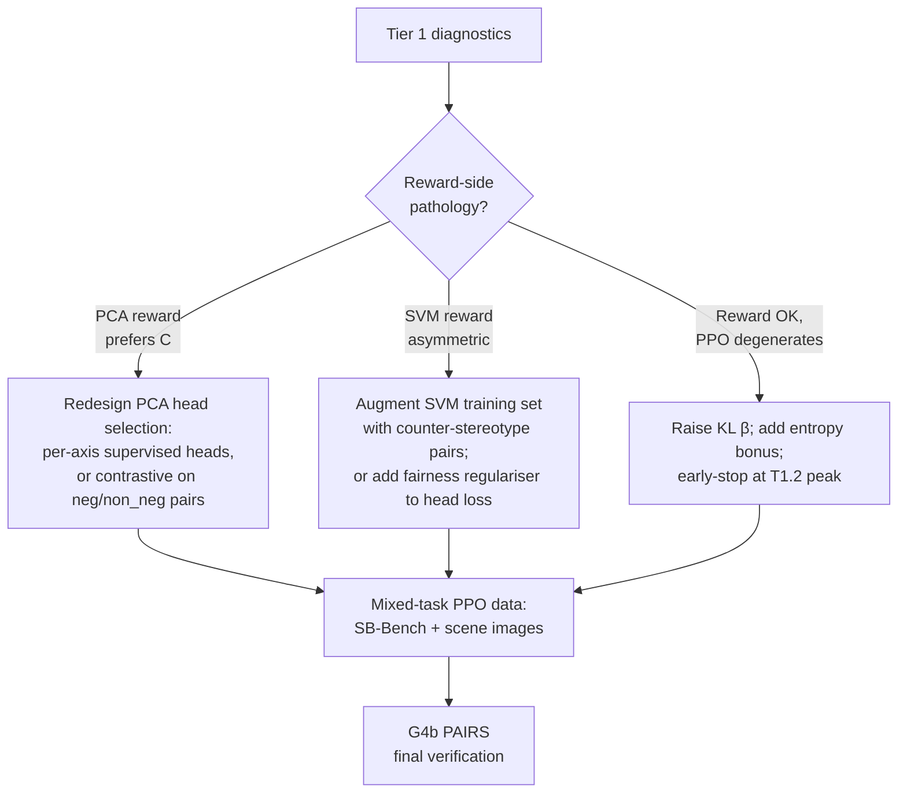

# Phase 0.7 Remediation Plan — Diagnosis Before Fix

> **Companion to [Phase0.7.md](Phase0.7.md).** Same content as §7 of that file, expanded with the underlying reasoning behind why G4b is demoted, why causal alignment is Tier 3, and why a single offline experiment (T1.1) carries most of the decision-relevant information.

## Short answer

**Do NOT prioritise G4b next.** G4b would give a third confirmation that SVM drifts and PCA collapses — it does not tell us *why*. The next move is a small set of **diagnostic** experiments that distinguish "the reward itself is broken" from "PPO breaks an OK reward," because those failure modes need completely different remediation. Causal alignment (CAA) is a layered post-hoc mitigation that addresses symptoms, not the underlying reward pathology — it belongs in Tier 3, not Tier 1.

---

## 1. Diagnosis-first framing

Two distinct pathologies are visible in [Phase0.7.md](Phase0.7.md) §5:

- **SVM late-training drift** (§5.6): bias score moves from +0.020 at `ep1-50pct` to −0.067 at `ep1-end`; per-axis bias on Race_x_SES, Race_x_gender, Disability *amplifies* with more training.
- **PCA mode-collapse** (§5.5): policy predicts "C" on 99.5–99.7% of all 3000 questions, regardless of axis or condition; disambig accuracy ≈ 0.

Each pathology has three mutually distinguishable roots. Remediation choice depends on which one is true.

| Pathology | (A) Reward-side hypothesis | (B) PPO-side hypothesis | (C) Data-side hypothesis |
|---|---|---|---|
| **SVM late drift** | Heads encode gold-routing on stereotype-correlated content, not fairness. The reward saturates and PPO exploits whatever spurious content correlates with gold. | PPO over-optimised past the well-aligned region; KL too weak; LR schedule allows late-training exploitation. | SB-Bench training distribution lacks counter-stereotype density on Race_x_SES / Race_x_gender / Disability axes. |
| **PCA mode-collapse** | PCA-100 pool encodes a "safety/confidence" direction more than a "fairness" direction. The reward is maximised by being unconfident; on disambig items the safest answer is "C". | PPO found a degenerate maximum; entropy regulariser too weak; the policy walked to always-C and got stuck. | PCA training data underweights named-gold disambig cases, so the reward never saw enough signal to distinguish "good named answer" from "lazy unknown". |

The single highest-leverage experiment distinguishes A from B for both rewards simultaneously, at near-zero cost. Run it first.

---

## 2. Why G4b PAIRS is not the right next step

G4b PAIRS would evaluate counterfactual pairs on the SVM checkpoints. The expected outcome is already implied by the per-axis bias scores in §5.7:

- SVM `ep1-end` will show counterfactual flip rates on Race_x_SES, Race_x_gender, Disability.
- SVM `ep1-50pct` will show fewer, mostly on Gender_identity.
- PCA will show ~0 flips because it always answers "C".

None of this distinguishes (A) reward-side from (B) PPO-side from (C) data-side, which is what we actually need to know before committing to a fix. **G4b becomes high-value as a post-remediation verification gate**, not a diagnostic.

---

## 3. Tier 1 — diagnostic experiments

### T1.1  Offline reward evaluation on VLBiasBench *(THE critical experiment)*

**Score the base policy's responses on VLBiasBench using both SVM and PCA reward heads — no PPO involved.**

Inputs already on Modal volume:
- `/mnt/data/phase07_vlbiasbench/base_vlbias_gen.jsonl` (3000 (prompt, response, gold, condition, bbq_axis) records)
- SVM heads under `/mnt/data/generated_heads_letter_pre_letter/sb_bench-SVM-component/`
- PCA heads under `/mnt/data/generated_heads_letter_pre_letter/sb_bench-PCA-component/`
- Kept-heads filters per head_type

Procedure: format each (prompt, response) pair as a `letter` completion chat, run the reward base model (`qwen2-vl-2b`) with `custom_forward(token_position="pre_letter")` to extract the penultimate hidden state at the position predicting the letter, apply each kept head's linear weight to obtain per-head rewards, average across kept heads.

For each reward head type, compute mean reward stratified by `(condition, correct/incorrect)`:

| Cell | Expected if reward is well-aligned | Diagnostic signal if not |
|---|---|---|
| `ambig, gold-C, model-C` (correct unknown) | high | — |
| `ambig, gold-C, model-A/B` (stereotype guess) | low | If high → reward rewards stereotype |
| `disambig (neg), model-correct-named` | high | If low → reward prefers C even when named is gold ⇒ **PCA pathology is in the reward, not PPO** |
| `disambig (non_neg), model-correct-named` | high | If lower than `neg`-correct → reward has stereotype asymmetry ⇒ **SVM drift is reward-side, not PPO-side** |

What this settles:
- If PCA reward already prefers "C" on disambig before PPO touches it → PCA-100 pool is the wrong feature subspace. Remediation: redesign head selection.
- If PCA reward is fine but PPO collapsed it → KL / entropy fix, not a reward redesign.
- Symmetric logic for SVM.

**Cost:** ≈ 1 A100-hour. No new training. This experiment should run before any other Tier-1 decision.

### T1.2  Per-checkpoint VLBiasBench trajectory *(early-stopping test)*

Saved SVM and PCA checkpoints (step0, 20, 40, 50pct, 60, 80, end) each run a small VLBiasBench eval (n=300 stratified). Plot for each variant:

- overall accuracy
- disambig accuracy
- |bias_score|
- ambig_unknown_rate

What this settles:
- If SVM disambig peaks at 50pct then falls → early stopping ≈ `ep1-50pct` is the prescribed remediation (no retraining needed, just deploy earlier checkpoint).
- If PCA mode-collapses *gradually* across training → confirms PPO degeneration. If it collapses at step 1 → confirms reward pathology.
- Locates exact drift point — informs KL-schedule tuning.

**Cost:** ≈ 2 GPU-hours (7 ckpts × 300 samples × 2 variants).

### T1.3  PCA head-count / signal-cutoff sweep

Without retraining PPO, just re-evaluate the offline PCA reward on the base model's VLBiasBench responses while varying:
- `kept_heads ∈ {50, 90, 150, 200}`
- `signal_cutoff ∈ {0.30, 0.45, 0.55, 0.70}`

If the "always-C" preference disappears at higher head counts → PCA-100 is too narrow a subspace. If it persists at 200/200 → PCA's variance-direction selection is fundamentally tracking confidence not fairness. **The latter would justify retiring PCA for a different head-selection strategy** (supervised contrastive heads, per-axis logistic heads).

**Cost:** offline only, ~30 minutes.

### T1.4  Counterfactual reward probe

Take 200 VLBiasBench items, swap demographic terms in the prompt (e.g. "elderly woman" ↔ "young man"), regenerate base-policy responses, score with both reward heads. If SVM reward changes when only the demographic flips with no answer change, the SVM heads encode demographic content rather than fairness-of-answer. This is the per-sample mechanism behind §5.6's late-training drift on Race_x_SES.

**Cost:** ≈ 1 GPU-hour.

---

## 4. Tier 2 — targeted remediation (conditional on Tier 1 outcome)

The branching tree:

Specifically:

- **If T1.1 shows PCA reward is the problem** → drop PCA-100 in current form. Try (a) supervised per-axis logistic heads on the same activation layer pool, or (b) contrastive heads trained on (correct-named, "C") pairs from disambig items so the head explicitly learns "named answer is preferable when context resolves".
- **If T1.1 shows SVM reward is the problem** → augment SVM training with explicit non_neg gold pairs (oversample counter-stereotype rows by ~3×), or add an asymmetry penalty: `loss += λ · |mean_reward(neg_gold) − mean_reward(non_neg_gold)|`.
- **If T1.2 shows clean peak-then-drift** → no reward changes needed; adopt `ep1-50pct` as deployment checkpoint and tighten KL for any future runs.
- **Scene-image regression** (§5.8, independent of bias issue) → mix VLBiasBench scene / scene_text items into PPO replay buffer at ~15% weight. Cheapest variant: short LoRA continued-training run on SVM `ep1-50pct` with mixed data.

---

## 5. Tier 3 — architecture-level options (only if Tier 1+2 fail)

### Causal Activation Alignment (CAA)

CAA computes a "fairness direction" from contrastive activations and subtracts it at inference. This is **symptom suppression**, not reward repair. It is genuinely useful as a complement to a working reward (apply on top of SVM `ep1-50pct` to further reduce residual axis-specific drift), but it cannot rescue a broken reward — PCA's mode-collapse is a policy distribution shift CAA cannot undo.

Schedule CAA *after* T1.1 + T1.2 outcomes. If SVM with early stopping + mixed-task PPO still shows residual Race_x_SES drift, layer CAA on top.

### Reward ensembling

Combine SVM (gold-routing signal) + PCA (calibration signal) + a small adversarial fairness head, weighted by validation bias score. Only worth it if T1.1 shows both rewards have *complementary* failure modes (not both broken in the same way).

### Larger / different DRM head set

Worth trying inside T1.3. If even 200/200 PCA heads don't escape the safety attractor, the issue is the variance-direction selection criterion itself, not the head budget.

---

## 6. Recommended sequence

1. **T1.1** offline reward evaluation on existing VLBiasBench responses — **decisive**
2. **T1.2** per-checkpoint trajectory (n=300) — locates drift point
3. **T1.3** PCA head-count sweep (offline) — cheap, may rule out reward-redesign
4. **T1.4** counterfactual reward probe — confirms SVM encoding hypothesis
5. **Tier-2 remediation** chosen by T1.1–T1.4 outcomes
6. **G4b PAIRS** as the final verification gate
7. **CAA layer** only if residual drift remains after Tier-2

**Total Tier-1 cost: ≈ 4 GPU-hours and zero new training runs.** This is the right next investment before committing to any larger remediation.
